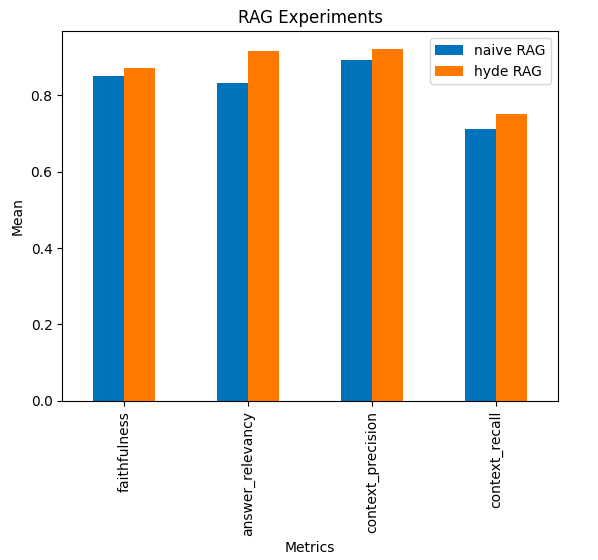

# RAG experiments

## Usage

```commandline
poetry install
```

## Structure

There are two components to any experiment:

- [Datasets](./datasets/)
- [Notebooks](./notebooks/)

## Example

To replicate the Naive vs HyDE Retrieval experiment on the `BioASQ` dataset:
1. Create the dataset : `poetry run python datasets/bioasq/download.py`
2. Run the notebooks
   1. Create the Vector Store with `notebooks/experiment_bioasq/vector_store.ipynb`
   2. Run the QA evaluation with `notebooks/experiment_bioasq/experiment.ipynb`

You can expect to see something like 